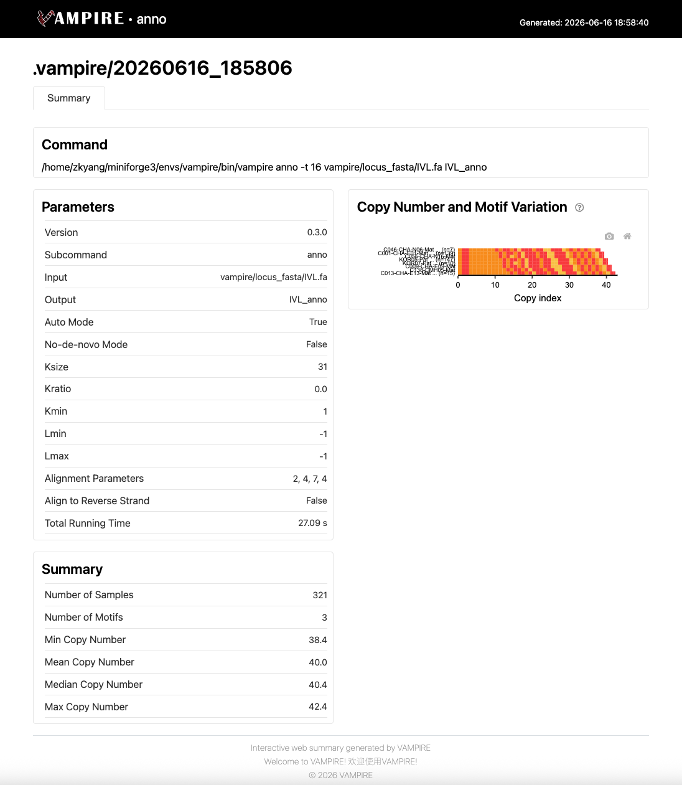

# anno

Annotate a single tandem repeat (TR) locus across polulation with motif decomposition and variation analysis.

This subcommand takes a FASTA file containing one or more sequences of a single TR locus (e.g., a STR, centromere or satellite array) and performs:

1. **Decomposition** — Builds a De Bruijn graph from k-mers to discover the underlying motif set, either de novo or using a reference motif database.
2. **Annotation** — Aligns the sequence against the discovered motifs to produce a motif-level annotation (position, copy number, orientation).
3. **Report generation** — Produces tabular outputs and an interactive HTML report summarizing motif composition and variation.
4. **h5ad file generation** - Produces h5ad file for downstream analysis.

## Usage

```bash
vampire anno [options] <input.fa> <output_prefix>
```

## Examples

```bash
# Auto-detect parameters (add --use-raw to capture every different motifs)
vampire anno （--use-raw） input.fa output/prefix

# Manually set k-mer size
vampire anno --no-auto -k 13 input.fa output/prefix

# Use a custom reference motif FASTA
vampire anno -m /path/to/motifs.fa input.fa output/prefix

# Disable de novo motif finding, use custom reference motif set
vampire anno --no-denovo -f -m /path/to/motifs.fa input.fa output/prefix

# Align motifs on the reverse strand as well (useful for long satellite sequences)
vampire anno --reverse input.fa output/prefix
```

## Example run

Below is a real run on a 30bp bp VNTR (chr1:152,046,914-152,048,075) in the gene *IVL* across 321 samples:

```fasta
>T2T-CHM13
TGGAGCTCCCAGAGCAGCAGGAGGGGCACCTGAAGCACCTAGAGCAGCAGGAGGGACAGCTGAAGCACCCGGAGCAGCAGGAGGGGCAGCTGGAGCTCCCAGAGCAGCAGGAGGGGCAGCTGGAGCTCCCAGAGCAGCAGGAGGGGCAGCTGGAGCTCCCAGAGCAGCAGGAGGGGCAGCTGGAGCTCCCAGAGCAGCAGGAGGGGCAGCTGGAGCTCCCACAGCAGCAGGAGGGGCAGCTGGAGCTCTCTGAGCAGCAGGAGGGGCAGCTGGAGCTCTCTGAGCAGCAGGAGGGGCAGCTGGAGCTCTCTGAGCAGCAGGAGGGACAGCTGAAGCACCTGGAGCACCAGGAGGGGCAGCTGGAGGTCCCAGAGGAGCAGATGGGGCAGCTGAAGTACCTGGAACAGCAGGAGGGGCAGCTGAAGCACCTGGATCAGCAGGAGAAGCAGCCAGAGCTCCCAGAGCAGCAGATGGGGCAGCTGAAGCACCTGGAGCAGCAGGAGGGGCAGCCTAAGCATCTGGAGCAGCAGGAGGGGCAACTGGAGCAGCTGGAGGAGCAGGAGGGGCAGCTGAAGCACCTGGAGCAGCAGGAGGGGCAGCTGGAGCACCTGGAGCACCAGGAAGGGCAGCTGGGGCTCCCAGAGCAGCAGGTGCTGCAGCTGAAGCAGCTAGAGAAGCAGCAGGGGCAGCCAAAgcacctggaggaggaggaggggcagctGAAGCACCTGGTGCAGCAGGAGGGGCAGCTGAAGCATCTGGTGCAGCAGGAGGGGCAGCTGGAGCAGCAGGAGAGGCAGGTGGAGCACCTGGAGCAGCAGGTGGGGCAGCTGAAGCACCTAGAGGAGCAGGAGGGACAACTGAAGCATCTGGAGCAGCAGCAGGGGCAGTTGGAGGTCCCAGAGCAGCAGGTGGGGCAGCCAAAGAacctggagcaggaggagaagcaaCTGGAGCTCCCAGAGCAGCAAGAGGGCCAGGTGAAGCACCTGGAGAAGCAGGAGGCACAGCTGGAGCTCCCAGAGCAGCAGGTAGGACAGCCAAAGCACCTGGAACAGCAGGAAAAGCACCTAGAGCACCCAGAGCAGCAGGACGGACAACTAAAACATCTGGAGCAGCAGGAGGGGCAGCTGAAGGACCTGGAGCAGCAGAAGGGGCAGCTGGAGCAGCCTG
...
```

Command:

```bash
vampire anno IVL.fa IVL_anno
```

### Discovered motif `IVL_anno.motif.tsv`:

| id | motif                          | copyNumber | label      |
| -: | :----------------------------- | ---------: | :--------- |
|  0 | GGAGCAGCAGGAGGGGCAGCTGAAGCTCCT |     5446.0 | unknown\_1 |
|  1 | AGAGCAGCAGGAGGGGCAGCTGGAGCTCCC |     5269.4 | unknown\_1 |
|  2 | GGTGCAGCAGGAGGGGCAGCTGAAGCATCT |     1296.0 | unknown\_1 |
|  3 | TGAGCAGCAGGAGGGGCAGCTGGAGCTCTC |      835.0 | unknown\_1 |

The motif is stored in its canonical rotation; the observed copies in the input are rotations of this sequence.

### Locus-level summary `IVL_anno.concise.tsv`:

| chrom     | length | start |  end | motif                                                                           |                                                                     orientation | copyNumber | score | cigar                                                                                                                                                                                                                                                                                                                                                                                                                                                                                                                                  |
| --------- | -----: | ----: | ---: | ------------------------------------------------------------------------------- | ------------------------------------------------------------------------------: | ---------: | ----: | -------------------------------------------------------------------------------------------------------------------------------------------------------------------------------------------------------------------------------------------------------------------------------------------------------------------------------------------------------------------------------------------------------------------------------------------------------------------------------------------------------------------------------------- |
| T2T-CHM13 |   1173 |     1 | 1173 | 1,0,0,1,1,1,1,1,3,3,3,0,1,0,0,1,0,2,0,0,0,1,0,0,2,1,1,0,0,2,1,0,1,0,1,0,1,2,0,1 | +,+,+,+,+,+,+,+,+,+,+,+,+,+,+,+,+,+,+,+,+,+,+,+,+,+,+,+,+,+,+,+,+,+,+,+,+,+,+,+ |       39.4 |  1620 | 28=1X1=/6=1X3=1X14=1X4=/6=1X2=1X20=/30=/30=/30=/30=/11=1X18=/30=/30=/25=1X4=/6=1X9=1X13=/5=1X8=1X5=2X8=/5=2X6=1X16=/6=1X6=1X9=2X5=/2X18=2X8=/6=1X23=/2X10=1X15=1X1=/2=1X3=2X6=1X15=/6=1X23=/2=1X3=1X9=1X5=1X7=/3=1X17=1X1=2X5=/6=2X2=1X3=1X5=1X9=/2X4=1X7=1X2=1X12=/7=1X22=/2=1X3=2X1=2X1=1X17=/3=7D1=2D10=1X5=1X/2=1X3=1X14=1X8=/6=1X3=1X3=1X10=1X2=1X1=/12=1X7=1X8=1X/5=1X15=1X8=/2X3=2X10=1X5=2X3=1X1=/19=1X5=1X3=1X/6=1X7=1X9=2X4=/21=2X2=1X4=/2X4=1X6=1X8=3X3=1X1=/1=1X4=1X15=1X2=1X2=1X1=/1=1X2=1X7=1X17=/5=2X13=1X9=/6=2X2=1X1= |
| ... | ... | ... | ... | ... | ... | ... | ... | ... |


`copyNumber` is the estimated total copy number of the motif across the locus, and `cigar` joins the per-block motif CIGARs (`/` separates blocks).

### Segment-level annotation `IVL_anno.annotation.tsv`:

| chrom     | length | start | end | motif | orientation | sequence                       | score | cigar            |
| --------- | -----: | ----: | --: | ----: | :---------: | ------------------------------ | ----: | ---------------- |
| T2T-CHM13 |   1173 |     1 |  30 |     1 |      +      | TGGAGCTCCCAGAGCAGCAGGAGGGGCACC |    54 | 28=1X1=/         |
| T2T-CHM13 |   1173 |    31 |  60 |     0 |      +      | TGAAGCACCTAGAGCAGCAGGAGGGACAGC |    42 | 6=1X3=1X14=1X4=/ |
| T2T-CHM13 |   1173 |    61 |  90 |     0 |      +      | TGAAGCACCCGGAGCAGCAGGAGGGGCAGC |    48 | 6=1X2=1X20=/     |
| T2T-CHM13 |   1173 |    91 | 120 |     1 |      +      | TGGAGCTCCCAGAGCAGCAGGAGGGGCAGC |    60 | 30=/             |
| T2T-CHM13 |   1173 |   121 | 150 |     1 |      +      | TGGAGCTCCCAGAGCAGCAGGAGGGGCAGC |    60 | 30=/             |
| ...       |    ... |   ... | ... |   ... |     ...     | ...                            |   ... | ...              |

Here, the first block contains a 1-bp mismatch (`28=1X1=/`) relative to the canonical motif, demonstrating the sequence 
divergence between the actual sequence and the annotated motif. Add the `--use-raw` parameter to capture every different motifs.

### Pairwise motif distance `IVL_anno.distance.tsv`:

| target | query | distance | is\_rc |
| -----: | ----: | -------: | :----- |
|      1 |     3 |        2 | false  |
|      0 |     3 |        3 | false  |
|      0 |     2 |        3 | false  |
|      0 |     1 |        3 | false  |
|      2 |     3 |        4 | false  |
|      1 |     2 |        6 | false  |
|      0 |     0 |       10 | true   |
|      3 |     3 |       11 | true   |
|      0 |     1 |       12 | true   |
|      1 |     3 |       13 | true   |
|      0 |     3 |       13 | true   |
|      0 |     2 |       13 | true   |
|      1 |     1 |       13 | true   |
|      2 |     3 |       14 | true   |
|      2 |     2 |       14 | true   |
|      1 |     2 |       15 | true   |

Here stores the pairwise distances between any two motifs on both strands. This will be used in the adata object construction process.

### Adata object `IVL_anno.h5ad`

The file is one of the core output of the VAMPIRE annotation pipeline, storing the processed satellite DNA motif annotation results in the AnnData format. This hierarchical data structure is designed for downstream analysis.

### Web summary `IVL_anno.web_summary.html`

This interactive HTML report presents the annotation results generated by the VAMPIRE. It provides a comprehensive overview of the parameters employed, copy number distribution, and waterfall plot across all samples.

 

### Downstream analysis using `vp.anno`

```python
import vampire as vp

# read_anno() use *.annotation/concise/motif/distance.tsv to load data

# directly use annotation results
adata = vp.anno.pp.read_anno("IVL_anno.annotation.tsv")

# use raw sequences
# read pre-computed raw sequence annotations (generated with --use-raw)
adata = vp.anno.pp.read_anno("IVL_anno_raw.annotation.tsv")
# compute raw sequences from standard annotation results
adata = vp.anno.pp.read_anno("IVL_anno.annotation.tsv", use_raw = True)
```

> **When to use** `--use-raw` for `vampire anno` **or** `use_raw=True` for `vp.anno.pp.read_anno()`
>
> Use this mode when you need to analyze the actual observed sequences
> instead of the detected, canonicalized motif catalog. This preserves rare variants
> and structural heterogeneity, but increases the number of motifs.
> 
> **Note:** Complex or mixed tandem repeats may yield ambiguous motif alignments
> and unstable phase calling in this mode.

## Example run

## Arguments

| Argument | Description |
|----------|-------------|
| `input` | Input FASTA file to annotate |
| `prefix` | Output prefix for all result files |

## Options

### General Options

| Option | Default | Description |
|--------|---------|-------------|
| `-t, --thread, --threads` | `4` | Number of threads |
| `--no-auto` | `False` | Skip automatic estimation of k-mer size and related parameters |
| `--debug` | `False` | Output debug info and keep temporary files |
| `--seq-win-size` | `5000` | Parallel window size for annotation (bp) |
| `--seq-ovlp-size` | `1000` | Overlap between consecutive windows (bp) |
| `-j, --job` | `None` | Job directory for temporary files |
| `-r, --resource` | `50` | Memory limit (GB) |

### Decomposition Options

| Option | Default | Description |
|--------|---------|-------------|
| `-k, --ksize` | `9` | k-mer size for building the De Bruijn graph |
| `-m, --motif` | `base` | Reference motif set path. Use `base` for the built-in default (FASTA) |
| `-n, --motifnum` | `100` | Maximum number of motifs to discover |
| `--kratio` | `0.00` | Minimum edge weight threshold relative to the top edge weight in the De Bruijn graph |
| `--kmin` | `1` | Minimum absolute edge weight in the De Bruijn graph |
| `--lmin` | `-1` | Minimum motif length (overrides auto-estimation if >0) |
| `--lmax` | `-1` | Maximum motif length (overrides auto-estimation if >0) |
| `--no-denovo` | `False` | Skip de novo motif discovery; annotate using only the reference motif set |

### Annotation Options

| Option | Default | Description |
|--------|---------|-------------|
| `-f, --force` | `False` | Force-add reference motifs into the annotation module |
| `--reverse` | `False` | Align motif on the reverse strand |
| `--annotation-min-similarity` | `0.6` | Minimum motif similarity required for annotation |
| `--finding-min-similarity` | `0.5` | Minimum motif similarity to match a query against the reference motif set |
| `--match-score` | `2` | Match score for alignment |
| `--mismatch-penalty` | `4` | Mismatch penalty for alignment |
| `--gap-open-penalty` | `7` | Gap open penalty for alignment |
| `--gap-extend-penalty` | `4` | Gap extend penalty for alignment |

### Output Options

| Option | Default | Description |
|--------|---------|-------------|
| `--use-raw` | `False` | Output raw motifs based on observed sequences without post-processing |
| `--skip-report` | `False` | Skip HTML report generation |
| `--skip-h5ad` | `False` | Skip h5ad generation |

## Output Files

Results are written with the provided `<prefix>`:

- `<prefix>.annotation.tsv` — Per-segment annotation (motif id, CIGAR, position, sequence)
- `<prefix>.concise.tsv` — Locus-level summary per sample (copy number, motif array, orientation)
- `<prefix>.motif.tsv` — Discovered motif metadata (motif sequence, copy number, label)
- `<prefix>.distance.tsv` — Pairwise motif distance matrix
- `<prefix>.web_summary.html` — Interactive HTML report (unless `--skip-report` is set)
- `<prefix>.h5ad` — Annotated data object for downstream analysis (unless `--skip-h5ad` is set)
- `<prefix>.log` — Run log

If `--use-raw` is set, the following additional files are generated:

- `<prefix>_raw.annotation.tsv`
- `<prefix>_raw.concise.tsv`
- `<prefix>_raw.motif.tsv`
- `<prefix>_raw.distance.tsv`
- `<prefix>_raw.h5ad` (unless `--skip-h5ad` is set)
