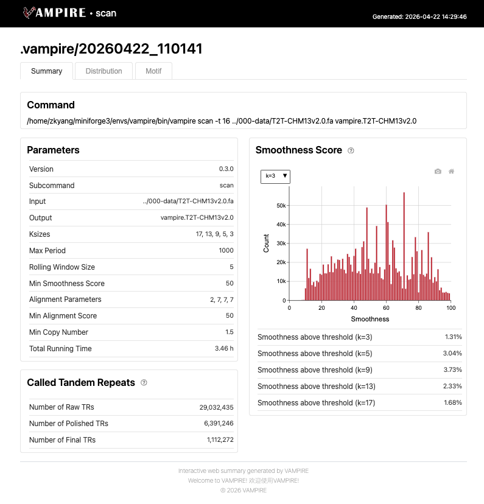
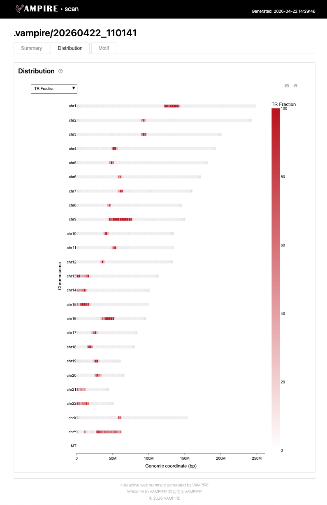
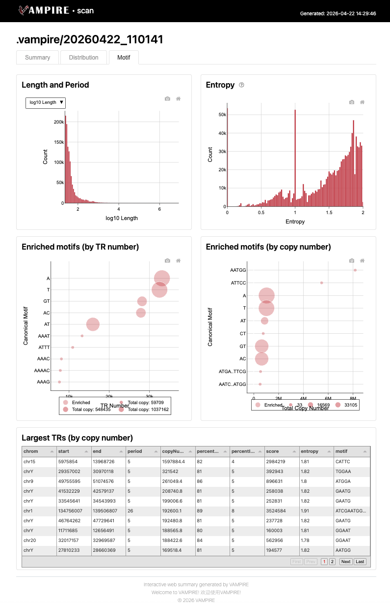

# scan

Scan and annotate tandem repeats (TRs) across a genome or long sequences.

This subcommand performs a genome-wide (or sequence-wide) scan to detect tandem repeat regions. It uses a multi-scale k-mer smoothness approach to identify candidate TR loci, followed by banded dynamic programming alignment to annotate period, copy number for each locus.

## Usage

```bash
vampire scan [options] <input.fa> <output_prefix>
```

## Examples

```bash
# Basic scan with 8 threads
vampire scan -t 8 genome.fa genome_scan

# Scan with custom alignment scoring parameters
vampire scan --match-score 2 --mismatch-penalty 4 --gap-open-penalty 7 --gap-open-penalty 4 -s 40 genome.fa genome_scan

# Output BED12 format with additional annotation columns
vampire scan --format bed genome.fa genome_scan

# Output secondary motifs when alignment score reaches 80% of the primary motif
vampire scan --secondary 0.8 genome.fa genome_scan
```

## Example run

Below is a real run on human reference genome T2T-CHM13v2.0:

Command:

```bash
vampire scan T2T-CHM13v2.0.fa T2T-CHM13v2.0_tr_scan
```

### Discovered TR `T2T-CHM13v2.0_tr_scan.tsv`

The output format basically follows the TRF output specification, using 1-based, fully closed intervals for all coordinates

| chrom | start |  end | period | copyNumber | consensusSize | percentMatches | percentIndels | score |   A |   C |   G |   T | entropy | motif  | sequence                                                                                                                                                                                                                                                                                                                                                                                                                      | cigar                                                                                                                                                                                                                                                                                                                                                                                                                                                                                                                                                                                                                                                                                                                                                                                                                                                                                                                                                                                                                                                                                                                                                                                                                                                                                                                                                                                                                                                                                                                                                                                                                                                                                                                                                   |
| ----- | ----: | ---: | -----: | ---------: | ------------: | -------------: | ------------: | ----: | --: | --: | --: | --: | ------: | ------ | ----------------------------------------------------------------------------------------------------------------------------------------------------------------------------------------------------------------------------------------------------------------------------------------------------------------------------------------------------------------------------------------------------------------------------- | ------------------------------------------------------------------------------------------------------------------------------------------------------------------------------------------------------------------------------------------------------------------------------------------------------------------------------------------------------------------------------------------------------------------------------------------------------------------------------------------------------------------------------------------------------------------------------------------------------------------------------------------------------------------------------------------------------------------------------------------------------------------------------------------------------------------------------------------------------------------------------------------------------------------------------------------------------------------------------------------------------------------------------------------------------------------------------------------------------------------------------------------------------------------------------------------------------------------------------------------------------------------------------------------------------------------------------------------------------------------------------------------------------------------------------------------------------------------------------------------------------------------------------------------------------------------------------------------------------------------------------------------------------------------------------------------------------------------------------------------------------- |
| chr1  |     2 | 2705 |      6 |      447.8 |             6 |             96 |             1 |  4547 |  31 |  52 |   1 |  16 |    1.52 | ACCCTA | ACCCTAAACCCTAACCCCTAACCCTAACCCTAACCCTAACCCTAACCCTAACCCTAACCCCTAAACCCTAACCCTAACCCTAACCCTAACCCTAACCCTAACCCTAACCCTAACCCTAACCCTAACCCTAACCCTAACCCTAACCCTAACCCTAACCCCTAACCCTAACCCTAACCCTAACCCTAACCCTAACCCTAACCCTAACCCTAACCCTAACCCTAACCCTAACCCTAACCCTAACCCTAACCCTAACCCTAACCCTAACCCTAACCCTAACCCTAACCCTAACCCTAACCCTAACCCTAACCCTAACCCTAACCCTAACCCTAACCCTAACCCTAACCCTAACCCTAACCCTAACCCTAACCCTAACCCTAACCCTAACCCTAACCCTAACCCTAACCCTAACCCTA | 6=/1=1I5=/4=1I2=/6=/6=/6=/6=/6=/4=1I2=/1=1I5=/6=/6=/6=/6=/6=/6=/6=/6=/6=/6=/6=/6=/6=/6=/6=/6=/6=/6=/4=1I2=/6=/6=/6=/6=/6=/6=/6=/6=/6=/6=/6=/6=/6=/6=/6=/6=/6=/4=1D1=/6=/6=/6=/6=/6=/6=/6=/6=/6=/6=/6=/6=/6=/6=/6=/6=/6=/6=/6=/6=/6=/6=/6=/6=/6=/6=/6=/6=/6=/6=/6=/6=/6=/6=/6=/6=/6=/6=/6=/6=/6=/6=/6=/6=/6=/6=/6=/6=/6=/6=/6=/6=/6=/6=/6=/6=/6=/6=/6=/6=/6=/6=/6=/6=/6=/6=/6=/6=/6=/6=/6=/6=/6=/6=/6=/6=/6=/6=/6=/6=/4=3I2=/6=/6=/6=/6=/6=/6=/6=/6=/6=/6=/6=/6=/6=/6=/6=/6=/6=/6=/5=1X/5=1X/5=1X/5=1X/5=1X/5=1X/5=1X/5=1X/5=1X/5=1X/5=1X/5=1X/5=1X/5=1X/5=1X/5=1X/5=1X/5=1X/5=1X/5=1X/5=1X/5=1X/5=1X/5=1X/5=1X/5=1X/5=1X/5=1X/5=1X/5=1X/5=1X/5=1X/6=/6=/6=/6=/6=/6=/6=/6=/6=/6=/6=/6=/6=/6=/6=/6=/6=/6=/6=/6=/6=/6=/6=/6=/6=/6=/6=/6=/6=/6=/6=/6=/6=/6=/6=/6=/6=/6=/6=/6=/6=/6=/6=/6=/6=/6=/6=/6=/1=2D1=1D1=/6=/6=/6=/6=/6=/6=/6=/6=/6=/6=/6=/6=/6=/6=/6=/6=/6=/6=/6=/6=/6=/6=/6=/6=/6=/6=/6=/6=/5=1I1=/6=/6=/6=/6=/6=/6=/1D5=/6=/6=/6=/6=/6=/6=/6=/5=1I1=/5=1I1=/6=/6=/6=/6=/6=/6=/1X5=/1X5=/1X5=/1X5=/1X5=/6=/1X3=1D1=/3=1I1=1D1=/3=1I1=1D1=/3=1I1=1D1=/3=1I1=1D1=/3=1I1=1D1=/3=1I1=1D1=/6=/6=/6=/6=/6=/6=/4=1D1=/6=/6=/6=/6=/6=/6=/6=/4=2I2=/6=/6=/6=/6=/4=1X1=/4=1X1=/4=1X1=/4=1X1=/4=1X1=/4=1X1=/4=1X1=/4=1X1=/4=1X1=/5=1I1=/6=/6=/6=/6=/6=/6=/6=/5=1I1=/6=/6=/6=/6=/6=/6=/5=1I1=/6=/6=/6=/6=/6=/6=/1D5=/6=/6=/6=/6=/6=/6=/1=1I5=/6=/6=/6=/6=/6=/6=/6=/6=/5=1I1=/6=/6=/6=/4=1D1X/5=1X/5=1X/5=1X/5=1X/5=1X/1I5=1X/5=1X/5=1X/5=1X/5=1X/5=1X/5=1X/6=/5=1X/6=/6=/6=/6=/6=/4=1D1=/4=1D1X/5=1X/5=1X/5=1X/5=1X/5=1X/5=1X/5=1X/6=/2=1X3=/6=/4=1I2=/6=/6=/6=/6=/6=/4=1I2=/6=/4=1I2=/1=1I5=/6=/6=/6=/6=/6=/6=/6=/1D5=/6=/6=/6=/6=/6=/6=/4=1I2=/6=/4=1I2=/6=/6=/6=/6=/6=/4=1I2=/6=/6=/6=/6=/6=/6=/4=1I2=/6=/4=1I2=/6=/6=/6=/6=/6=/4=1I2=/6=/6=/6=/6=/6=/6=/5= |
| ...   |   ... |  ... |    ... |        ... |           ... |            ... |           ... |   ... | ... | ... | ... | ... |     ... | ...    | ...                                                                                                                                                                                                                                                                                                                                                                                                                           | ...                                                                                                                                                                                                                                                                                                                                                                                                                                                                                                                                                                                                                                                                                                                                                                                                                                                                                                                                                                                                                                                                                                                                                                                                                                                                                                                                                                                                                                                                                                                                                                                                                                                                                                                                                     |


### Web summary `T2T-CHM13v2.0_tr_scan.web_summary.html`

This interactive HTML report contains three tabs: `Summary`, `Distribution` and `Motif`.

The `Summary` tab provides an overview of the tandem repeat (TR) scanning run, including the executed command, parameter settings, and key statistics. The "Smoothness Score" panel visualizes the distribution of k-mer smoothness scores across different k-mer sizes, indicating the proportion of genomic regions passing the periodicity threshold. The "Called Tandem Repeats" section reports the number of raw, polished, and final TR calls after successive filtering stages.

 

The `Distribution` tab displays the genomic landscape of detected tandem repeats across all chromosomes. The interactive ideogram shows TR density as a fraction of each chromosome (TR Fraction), with red bars indicating repeat-rich regions, such as centromere regions. Users can toggle between different metrics (e.g., TR fration, median TR length, median motif length) to explore chromosome-specific TR distribution patterns.

 

The `Motif` tab presents detailed characterization of the detected repeat motifs. Includes histograms of TR length/period and sequence entropy, bubble charts of enriched canonical motifs ranked by TR number or total copy number, and a sortable table of the largest tandem repeats by copy number.

 

## Arguments

| Argument | Description |
|----------|-------------|
| `input` | Input FASTA file to scan for tandem repeats |
| `prefix` | Output prefix for all result files |

## Options

### General Options

| Option | Default | Description |
|--------|---------|-------------|
| `-t, --thread, --threads` | `8` | Number of threads |
| `--debug` | `False` | Output debug info and keep temporary files |
| `--seq-win-size` | `5000000` | Window sequence size for scanning (bp) |
| `--seq-ovlp-size` | `100000` | Overlap sequence size between consecutive windows (bp) |
| `-j, --job` | `None` | Job directory for temporary files |

### Candidate Finding Options

| Option | Default | Description |
|--------|---------|-------------|
| `--ksize` | `17,13,9,5,3` | Comma-separated list of k-mer sizes for candidate detection. Smaller k-mer sizes improve sensitivity for long-period TRs. |
| `--rolling-win-size` | `5` | Rolling window size to compute smoothness score |
| `--min-smoothness` | `50` | Minimum smoothness score to call a candidate region |

### Alignment Options

| Option | Default | Description |
|--------|---------|-------------|
| `--match-score` | `2` | Match score for alignment |
| `--mismatch-penalty` | `7` | Mismatch penalty for alignment |
| `--gap-open-penalty` | `7` | Gap open penalty for alignment |
| `--gap-extend-penalty` | `7` | Gap extend penalty for alignment |

### Output Options

| Option | Default | Description |
|--------|---------|-------------|
| `-p, --max-period` | `1000` | Maximum period (motif length) for output |
| `-s, --min-score` | `50` | Minimum alignment score for output |
| `-c, --min-copy` | `1.5` | Minimum copy number for output |
| `--secondary` | `1.0` | Minimum secondary annotation score relative to primary. Set to `1.0` to disable secondary annotation. |
| `--format` | `trf` | Output format (`brief`, `trf`, or `bed`) |
| `--skip-cigar` | `False` | Skip CIGAR string in output |
| `--skip-report` | `False` | Skip HTML report generation |

## Output Files

Results are written with the provided `<prefix>`:

- `<prefix>.tsv` — Main annotation table (TRF-like format by default; columns depend on `--format` and `--skip-cigar`)
- `<prefix>.bed` — BED-format annotation, generated only when `--format bed` is set
- `<prefix>.web_summary.html` — Interactive HTML report (unless `--skip-report` is set or no repeats are detected)
- `<prefix>.log` — Run log
